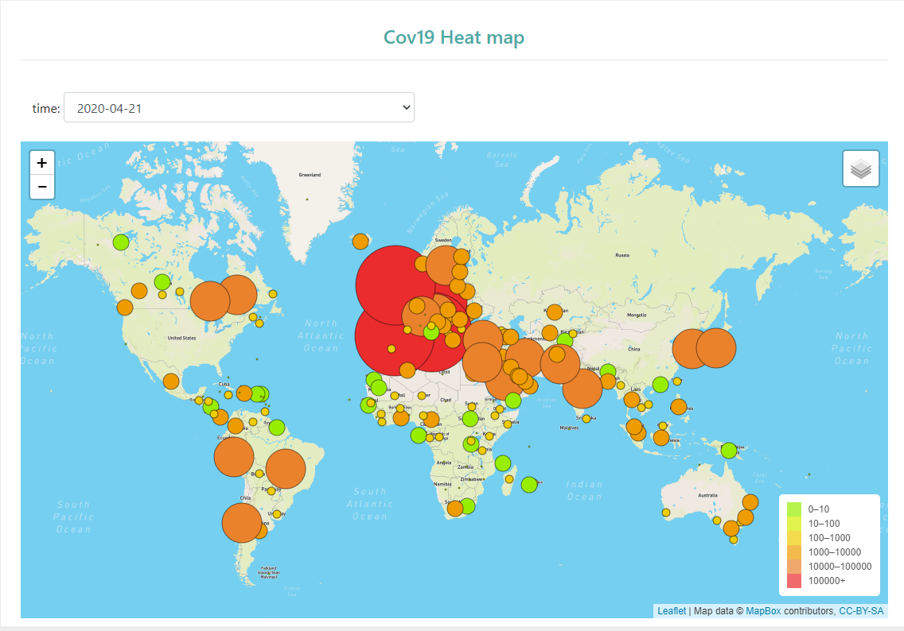
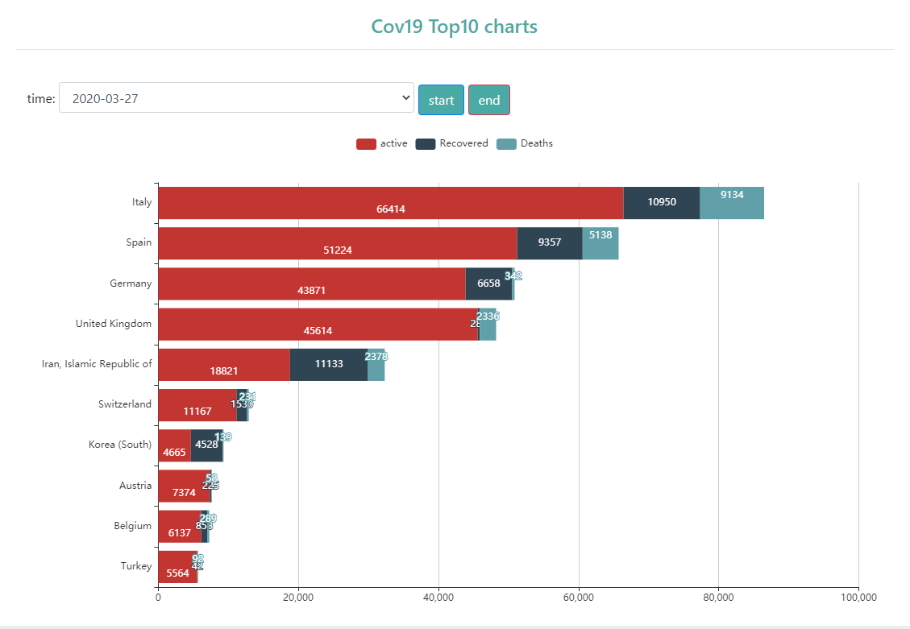
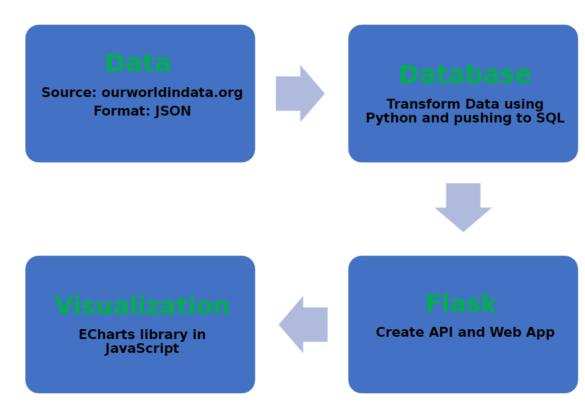

Project Title : Covid-19 Analysis   
 
Team Members : Nerojan, Prateek, Jialong, Edward  
 
Project Description/Outline
 
Covid-19 has had a dramatic impact on our lives and resulted in the death of many individuals around the world. We will visualize live updates on deaths, total cases, total confirmed and total recovered. This easy to understand dynamic visualization will allow anyone who do not have any knowledge in data can grab the fresh information about the COVID 19 all over the globe. 

 
In addition, we’ll use regression and classification supervised machine learning models to predict future trends in infections, recovery rates, deaths and also to classify countries by level of COVID risk, effectiveness of government measures. We’ll host our application on Heroku to visualize and apply the ML models in real time.
 

 
Questions:

1.	What are the most important features of a country in predicting COVID death rates, recovery rates and trend in infection?
2.	Does lockdown measures work?
3.	Does the weather effect or region effect infection rates? 

 

 
Models to use/try:

•	Multiple liner regression
•	Random forest
•	KNN
•	Neural networks

 
 
Datasets to Be Used 
https://www.stats.govt.nz/assets/Uploads/Effects-of-COVID-19-on-trade/Effects-of-COVID-19-on-trade-1-February-10-June-2020-provisional/Download-data/Effects-of-COVID-19-on-trade-1-February-10-June-2020-provisional.csv
https://www.kaggle.com/sudalairajkumar/novel-corona-virus-2019-dataset/data?select=covid_19_data.csv
https://documenter.getpostman.com/view/10808728/SzS8rjbc
API
https://api.covid19api.com/
https://api.covid19api.com/countries

Visualizations/Screenshots:

Work Flow

